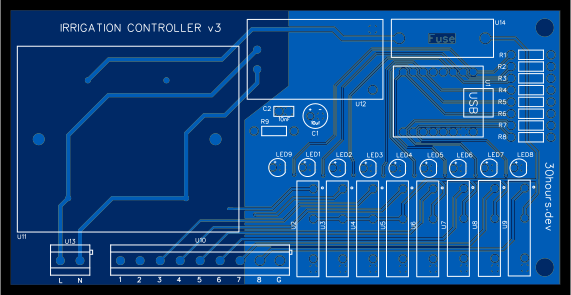

# irrigation

Hardware and firmware for an irrigation controller on an ESP32. 

Designed to control 24VAC solenoid valves.

## Schematic


## PCB

- PCB has been designed in [EasyEDA Standard](https://easyeda.com/).
- Board size is 140 mm x 70 mm.
- Includes M4 mounting holes.
- 2 layer board.



## Hardware

Use the Gerber files in [hardware](hardware) to print a PCB from your favourite supplier and solder components to the board.

See [hardware/README.md](hardware/README.md) for more information.

## Firmware

Flash the ESP32-C3 using the following steps:

```
python3 -m venv irrigation
source irrigation/bin/activate
pip3 install esptool esphome
esptool.py --port /dev/ttyACM0 erase_flash
esphome run irrigation.yaml
```

The firmware uses [ESPHome](https://esphome.io/index.html) which has default support for Home Assistant.

## Usage

**Initial setup:**

- Connect power to the device.
- Connect to the WiFi network `Irrigation Controller` and enter password `irrigation`.
- Open the web browser to `192.168.4.1` and connect to your WiFi network.
- Find the IP address of the ESP32-C3 from your WiFi router devices list. Alternatively run `sudo nmap -sP $(hostname -I | awk '{print $1}')/24`.
- Assign a static IP to the ESP32-C3 from WiFi router settings.

**Operation:**

- Navigate to the static IP assigned in the initial setup.
- Use the ESPHome web interface to control solenoids.

**Home Assistant setup:**

- In Home Assistant navigate to `Settings`, `Devices and Services`, `Add Integration`, `ESPHome`.
- Add the host as the static IP assigned in the initial setup, and leave the port as `6053`.
- Enter the encryption key found in `irrigation.yaml`.
- The ESPHome device will expose the 8 solenoid switch entities.

## Future Work

- Add pictures of installed controller.
- Design 3D printed case.

## License

[MIT](https://choosealicense.com/licenses/mit/)